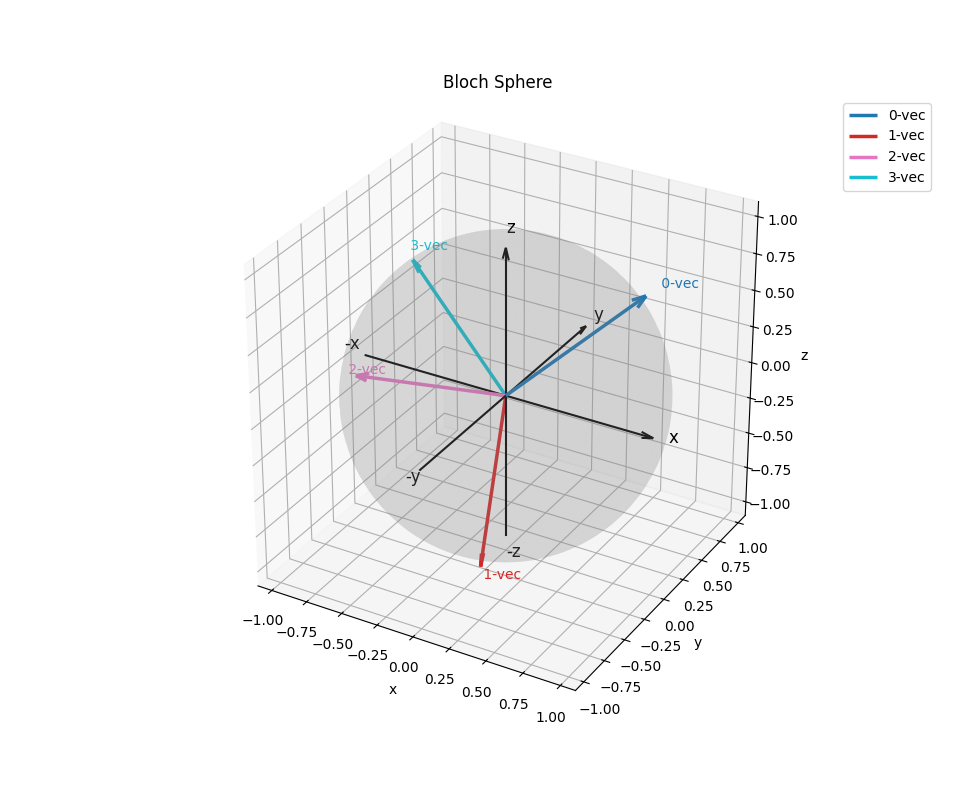

# QuantumInformation

This repository is an attempt to practically implement the theory taught in
IBM's course, **General Formulation of Quantum Information**. The code is written
with NumPy and Qiskit so the mathematical objects from the course can be built,
inspected, and tested directly.

The main goal is to keep the basic objects easy to inspect: density matrices,
Bloch vectors, projective measurements, POVMs, post-measurement states, quantum
channels, Kraus operators, Choi matrices, purifications, Schmidt
decompositions, fidelity calculations, and a simple ancilla-based measurement
example.

Most of the code is meant to be readable first. It is useful for learning,
testing small ideas, and checking the math step by step.

## Project structure

```text
QuantumInformation/
|-- main.py
|-- main-1.py
|-- requirements.txt
|-- plots/
|   |-- Figure_1.png
|   `-- main-1-bloch-showcase.png
|-- research/
|   |-- DensityMatrix.ipynb
|   |-- GeneralMeasurements.ipynb
|   |-- PurificationFidelity.ipynb
|   `-- QuantumChannels.ipynb
`-- src/
    `-- QuInfo/
        `-- utils/
            |-- DensityMatrix.py
            |-- genMeasurements.py
            |-- PurificationFidelity.py
            `-- QuantumChannels.py
```

## Core modules

### `DensityMatrix.py`

This file has the density-matrix related helpers. It is mostly about checking
whether a matrix is physically valid, printing useful reports, and getting simple
measurement or Bloch-vector information from a state.

Some useful things inside this file:

- Convert Qiskit density matrices or array-like input into NumPy matrices.
- Pretty-print matrices.
- Check square shape, Hermiticity, trace, eigenvalues, positive semidefinite
  status, and density-matrix validity.
- Compute purity with `Tr(rho^2)`.
- Create density matrices from Qiskit state labels such as `"0"`, `"+"`, or
  `"r+1"`.
- Compute standard-basis measurement probabilities.
- Compute and plot one-qubit Bloch vectors.

### `genMeasurements.py`

This file is for measurement-related utilities. It covers projectors, POVMs,
measurement probabilities, sampling, partial measurements, and a small
ancilla-based experiment.

Some useful things inside this file:

- Normalize statevectors and density matrices.
- Build rank-1 projectors from statevectors.
- Build standard computational-basis projectors.
- Sum and validate POVM elements.
- Compute POVM measurement probabilities.
- Build the classical output density matrix of a measurement channel.
- Compute partial measurement probabilities on a two-qubit state.
- Compute the conditional state of the second qubit after measuring the first.
- Validate probability vectors and sample measurement outcomes.
- Estimate a `+1/-1` expectation value from samples.
- Demonstrate a simple ancilla measurement using a CNOT circuit.

### `PurificationFidelity.py`

This file is for purification, Schmidt decomposition, and fidelity utilities.
It connects mixed-state density matrices with pure-state purifications and gives
small helpers for checking the overlap and fidelity relationships used in
Uhlmann-style arguments.

Some useful things inside this file:

- Compute the spectral decomposition of a density matrix.
- Build a canonical purification from the spectral decomposition.
- Build a canonical purification with a fixed ancilla dimension.
- Recover a reduced density matrix by tracing out selected subsystems.
- Compute a Schmidt decomposition of a bipartite pure state.
- Reconstruct a statevector from Schmidt coefficients and vectors.
- Generate and validate random unitary matrices.
- Apply a unitary on the second subsystem of a bipartite state.
- Compute pure-state overlap.
- Compute density-matrix fidelity and root fidelity.

### `QuantumChannels.py`

This file is for quantum-channel utilities. It covers closed-system unitary
evolution, classical convex combinations of channel outputs, Kraus
representations, standard one-qubit noise channels, local channels on one
subsystem of a two-qubit state, and Choi-matrix based channel checks.

Some useful ideas demonstrated there:

- Apply a unitary channel with `U rho U^dagger`.
- Combine channel outputs using classical probabilities.
- Apply channels from Kraus operators and check the completeness relation.
- Use reset, dephasing, depolarizing, noisy dephasing, and noisy depolarizing
  channels.
- Apply a one-qubit channel to the first qubit of a two-qubit state.
- Build a Choi matrix from the channel definition.
- Check trace preservation by tracing out the output system of a Choi matrix.
- Apply a channel using its Choi representation.

## Showcase scripts

### `main.py`

This is the original small showcase file. It runs a few examples from the density
matrix and measurement utilities.

### `main-1.py`

This is a more complete showcase file. It is organized into four main sections:

- `DensityMatrix.py helpers`
- `genMeasurements.py helpers`
- `PurificationFidelity.py helpers`
- `Quantum channel helpers`

It walks through density-matrix diagnostics, state labels, standard-basis
probabilities, Bloch-vector plotting, projectors, POVMs, measurement channels,
partial measurements, conditional states, sampling, post-measurement states, and
the ancilla example. It also demonstrates spectral decomposition, purification,
partial trace recovery, Schmidt decomposition, reconstruction, subsystem unitary
actions, overlap, manual fidelity, root fidelity, unitary channels, Kraus
channels, one-qubit noise channels, local channels on a two-qubit state, and
Choi-matrix representations.

Running `main-1.py` also writes this plot:

```text
plots/main-1-bloch-showcase.png
```

## Running the showcase

Run this from the `QuantumInformation` project root:

```powershell
python main-1.py
```

If `python` is not available on your PATH, use the environment included in this
folder:

```powershell
& '.\QuantumInfoVenv\python.exe' main-1.py
```

## Quick examples

### Create and inspect a density matrix

```python
import numpy as np

from src.QuInfo.utils.DensityMatrix import report_density_matrix

rho = np.array(
    [
        [0.5, -0.3j],
        [0.3j, 0.5],
    ]
)

report_density_matrix(rho, name="rho")
```

### Build a density matrix from a state label

```python
from src.QuInfo.utils.DensityMatrix import (
    densityMatrix_from_label,
    measurement_probabilities_standard_basis,
)

rho_plus = densityMatrix_from_label("+")
probs = measurement_probabilities_standard_basis(rho_plus)

print(probs)
```

### Measure a state with computational-basis projectors

```python
from src.QuInfo.utils.DensityMatrix import densityMatrix_from_label, to_numpy_matrix
from src.QuInfo.utils.genMeasurements import (
    measurement_probabilities,
    standard_basis_projectors,
)

rho_plus = to_numpy_matrix(densityMatrix_from_label("+"))
z_projectors = standard_basis_projectors()

print(measurement_probabilities(rho_plus, z_projectors))
```

### Sample measurement outcomes

```python
from src.QuInfo.utils.genMeasurements import (
    estimate_exception_from_pm1,
    sample_measurement,
    validate_probability_vector,
)

probs = validate_probability_vector([0.5, 0.5])
samples = sample_measurement(probs, shots=20)

print(samples)
print(estimate_exception_from_pm1(samples))
```

### Purify a density matrix and recover the reduced state

```python
import numpy as np

from src.QuInfo.utils.PurificationFidelity import (
    canonical_purification_fixed_ancilla_dim,
    reduced_system_from_purification,
)

rho = np.array(
    [
        [0.5, -0.3j],
        [0.3j, 0.5],
    ],
    dtype=np.complex128,
)

psi = canonical_purification_fixed_ancilla_dim(rho, ancilla_dim=2)
rho_recovered = reduced_system_from_purification(
    psi,
    system_dims=[2, 2],
    trace_out_subsystems=[1],
)

print(psi)
print(rho_recovered)
```

### Compute fidelity between density matrices

```python
import numpy as np

from src.QuInfo.utils.DensityMatrix import densityMatrix_from_label
from src.QuInfo.utils.PurificationFidelity import manual_fidelity, root_fidelity

rho = np.array(
    [
        [0.5, -0.3j],
        [0.3j, 0.5],
    ],
    dtype=np.complex128,
)
sigma = densityMatrix_from_label("+")

print(manual_fidelity(rho, sigma))
print(root_fidelity(rho, sigma))
```

### Apply a dephasing channel through its Choi matrix

The Choi-matrix example is demonstrated in both places:

```powershell
python main-1.py
```

and in:

```text
research/QuantumChannels.ipynb
```

## Figure showcase

There is also an example Bloch-sphere plot in the `plots` folder:



This is the same kind of plot that can be made with `plot_bloch_vectors`:

```python
from src.QuInfo.utils.DensityMatrix import plot_bloch_vectors

plot_bloch_vectors(
    {
        "0-vec": [1, 0, 1],
        "1-vec": [0.1, -0.5, -1],
        "2-vec": [-0.5, -1, 0.5],
        "3-vec": [-1, 0.5, 0.5],
    },
    "Bloch Sphere",
)
```

## Requirements

The full dependency list is in `requirements.txt`. The main libraries used here
are:

- NumPy
- Matplotlib
- Qiskit

## Notes

`main-1.py` has a couple of small local compatibility fixes so the showcase can
run with the current code without changing the utility modules. It handles the
NumPy removal of `np.float` and the small `tol` / `tolerance` keyword mismatch in
a few measurement helper calls.
